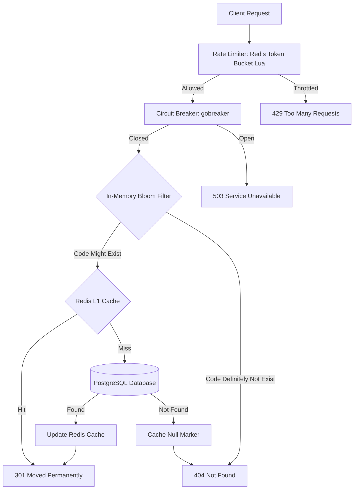
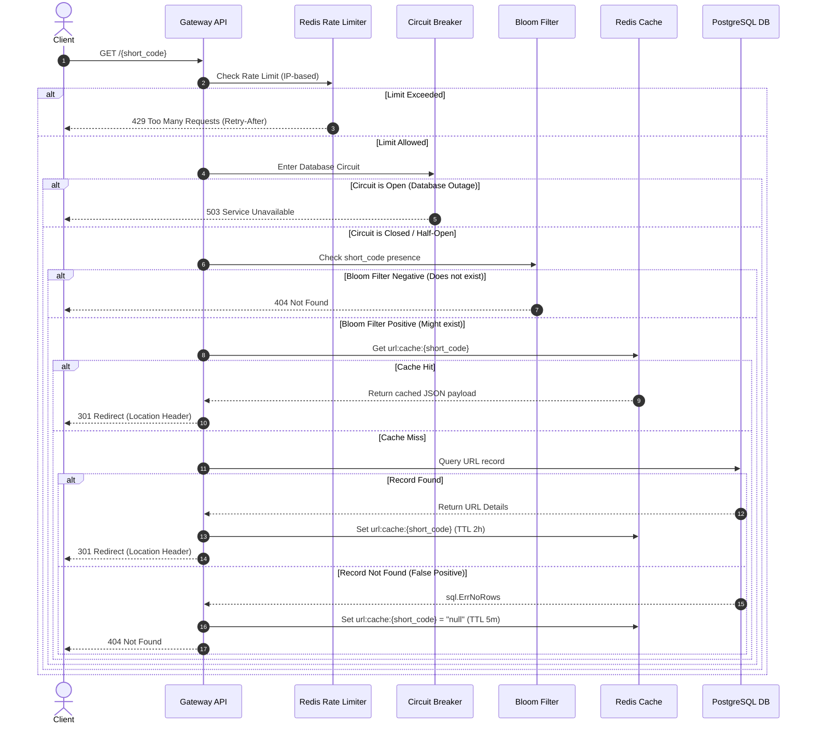
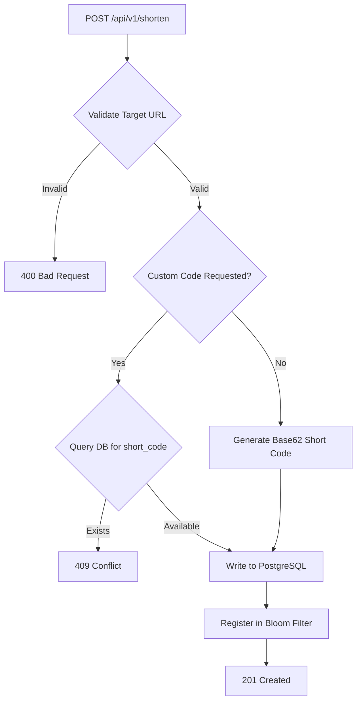

# Lynx-API Distributed Redirection Engine

A production-grade, enterprise-ready, high-throughput URL shortening and redirection gateway engineered in Go. The platform leverages PostgreSQL for persistent storage, Redis for distributed caching and atomic rate limiting, and an in-memory Bloom Filter to prevent cache penetration. Observability is natively supported via Prometheus metrics and OpenTelemetry tracing.

---

## System Architecture

The engine is structured as a low-latency, resilient redirection pipeline. The hot path (resolving URLs) runs in sub-millisecond speeds due to L1 cache checks combined with a Bloom Filter to instantly reject nonexistent requests.



---

## Detailed Workflows

### 1. The Redirection pipeline (Hot Path)

This sequence diagram outlines the end-to-end processing pipeline of a GET request resolving a short URL.



### 2. URL Shortening Workflow

Processes URL generation requests, ensuring Base62 validation, collision checks, and cache warming.



---

## Core Resilience Patterns

### 1. Cache Penetration Defense (Bloom Filter + Null Marker)
*   **The Problem:** An attacker spamming lookups for millions of random, nonexistent short codes could bypass cache layers entirely, inundating the database (Cache Penetration).
*   **The Defense:**
    1.  **Bloom Filter:** An in-memory Bloom Filter checks every request on the hot path. If the filter returns `false`, the code definitely does not exist, and the gateway rejects it immediately without querying Redis or PostgreSQL.
    2.  **Null Markers:** If the Bloom Filter yields a false positive and the database query returns `not found`, the engine writes a "null marker" value (`"null"`) to Redis with a short TTL (5 minutes). Subsquent hits for this nonexistent code hit the cache instead of hit the database.

### 2. Microsecond-Precision Atomic Rate Limiting
Rate limiting is enforced at the gateway level using a token-bucket algorithm executed as a single Redis Lua script (`scripts/lua/token_bucket.lua`). This guarantees:
- **Atomicity:** All check-and-decrement actions run as a transactional command within Redis.
- **Microsecond Refills:** Refill rates are evaluated dynamically on request timestamp differences in microseconds, eliminating race conditions.
- **Fail-Open Resiliency:** If Redis goes down, the rate limiting layer logs the failure and fails open, ensuring service availability.

### 3. Database Isolation (Circuit Breaker)
A `gobreaker` circuit breaker wraps all database query calls. 
- If the database error rate exceeds **60%** within a sliding window, the circuit transitions to **Open**, immediately failing-fast with an HTTP `503 Service Unavailable` for subsequent misses.
- After a cool-down period of **10 seconds**, the circuit enters **Half-Open**, permitting test requests to verify database health before closing the circuit again.

---

## Project Structure

```
├── cmd/
│   └── gateway/
│       └── main.go                  # Bootstrap, DI container initialization
├── internal/
│   ├── cache/                       # Redis caching and Bloom filter logic
│   ├── config/                      # Viper configuration loader (YAML + Env)
│   ├── encoding/                    # Base62 encoder engine
│   ├── handler/                     # HTTP router controllers / Handlers
│   ├── middleware/                  # Rate limiter, Logger, CORS, Circuit Breaker
│   ├── model/                       # Shared domain structures & sentinel errors
│   ├── repository/                  # PostgreSQL db access patterns via pgx pool
│   ├── router/                      # HTTP routing definitions
│   ├── server/                      # HTTP server lifecycle control & Graceful shutdown
│   ├── service/                     # URL Shortening business logic orchestrator
│   └── telemetry/                   # Prometheus metrics and OpenTelemetry trace setup
├── deploy/
│   ├── docker/
│   │   ├── Dockerfile               # Multi-stage production container build
│   │   └── Dockerfile.dev           # Development hot-reload setup (via Air)
│   ├── prometheus/
│   │   └── prometheus.yml           # Prometheus scrape setup targeting API Gateway
│   └── docker-compose.yml           # Local production-mirror stack orchestration
├── migrations/                      # DB Schema files (000001_create_urls_table)
├── pkg/
│   └── validator/                   # Custom URI validation utils
├── scripts/
│   ├── lua/
│   │   └── token_bucket.lua         # Rate-limiting engine algorithm
│   └── migrate.sh                   # Automation wrapper script for DB migrations
└── test/
    ├── integration/                 # Gateway endpoint tests
    └── load/
        └── k6_scenario.js           # k6 performance test scenarios
```

---

## API Specification

All payloads use strict JSON format.

### 1. Shorten URL
`POST /api/v1/shorten`

*   **Request Body:**
    ```json
    {
      "url": "https://deepmind.google/technologies/gemini/#introduction",
      "expires_in": 86400
    }
    ```
*   **Response (201 Created):**
    ```json
    {
      "short_code": "PSlKef8",
      "short_url": "http://localhost:8080/PSlKef8",
      "original_url": "https://deepmind.google/technologies/gemini/#introduction"
    }
    ```

### 2. Resolve Code
`GET /{short_code}`

*   **Response (301 Moved Permanently):**
    *   `Location` Header: containing target URL.

### 3. Retrieve Stats
`GET /api/v1/stats/{short_code}`

*   **Response (200 OK):**
    ```json
    {
      "short_code": "PSlKef8",
      "original_url": "https://deepmind.google/technologies/gemini/#introduction",
      "clicks": 42,
      "created_at": "2026-07-08T14:11:23.616124Z",
      "is_active": true
    }
    ```

### 4. Health Probes
*   `GET /healthz` - Fast process liveness probe.
*   `GET /readyz` - Dynamic readiness check validating active connection to Redis and PostgreSQL.

---

## Orchestration & Installation

### Quick Start (Full Stack Containerised)

The complete stack includes the Gateway API, PostgreSQL, Redis, Prometheus, and Grafana.

```bash
# Clone the repository
git clone https://github.com/shashank1810/Lynx-API-Distributed-Redirection-Engine.git
cd Lynx-API-Distributed-Redirection-Engine

# Start the cluster
docker compose -f deploy/docker-compose.yml up --build -d

# Verify system container health
docker compose -f deploy/docker-compose.yml ps
```

---

## Observability Dashboards

| Service | Port | URL |
| :--- | :--- | :--- |
| **Gateway Engine** | `8080` | `http://localhost:8080` |
| **Prometheus** | `9090` | `http://localhost:9090` |
| **Grafana** | `3000` | `http://localhost:3000` (admin/admin) |

### Key Custom Metrics Exposed

- `gateway_http_requests_total{method, path, status}`: Requests counter.
- `gateway_http_request_duration_seconds{method, path, status}`: Request latency histogram.
- `gateway_cache_hits_total` / `gateway_cache_misses_total`: Cache efficiency.
- `gateway_ratelimit_allowed_total` / `gateway_ratelimit_denied_total`: Rate limiter activity.
- `gateway_circuit_breaker_state{name}`: Value represents breaker state (0 = Closed, 1 = Half-Open, 2 = Open).

---

## Load Verification

Automated load test scenario executes smoke, ramp-up, and spike load tests via `k6`.

```bash
# Executing test suite
k6 run test/load/k6_scenario.js
```

### Performance Benchmarks (SLOs)

| Metric | Threshold |
| :--- | :--- |
| **P95 Latency** | `< 200ms` |
| **P99 Latency** | `< 500ms` |
| **Error Rate** | `< 1%` |
| **RPS Target (Spike)** | `2000 Requests/sec` |

---

## License

This project is licensed under the MIT License. See the `LICENSE` file for details.
